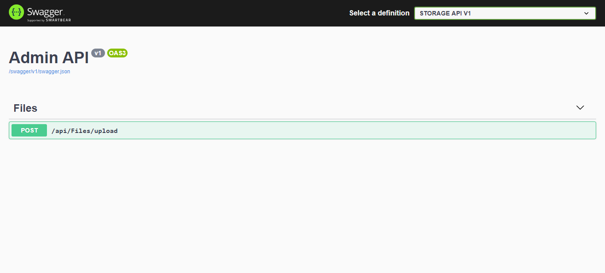

# Introduction 
`Storage Api` is a open source project for everyone. Every member can upload file. 

#Technology Stack
1. ASP.NET Core 3.1
2. SQL Server 2019

# How to run this Project
1. Clone this source code from Repository
2. Build solution to restore all Nuget Packages
2. Set startup project is `storage-api`
4. Set startup project to multiple projects include: `storage-api`

# References
- [ASP.NET Core](https://docs.microsoft.com/en-us/aspnet/core/?view=aspnetcore-3.1)
- [Visual Studio](https://visualstudio.microsoft.com/)

- https://medium.com/@matthew.bajorek/configuring-serilog-in-asp-net-core-2-2-web-api-5e0f4d89749c
- https://docs.microsoft.com/en-us/aspnet/core/performance/caching/distributed?view=aspnetcore-3.1

# Screenshot

- Swagger api

