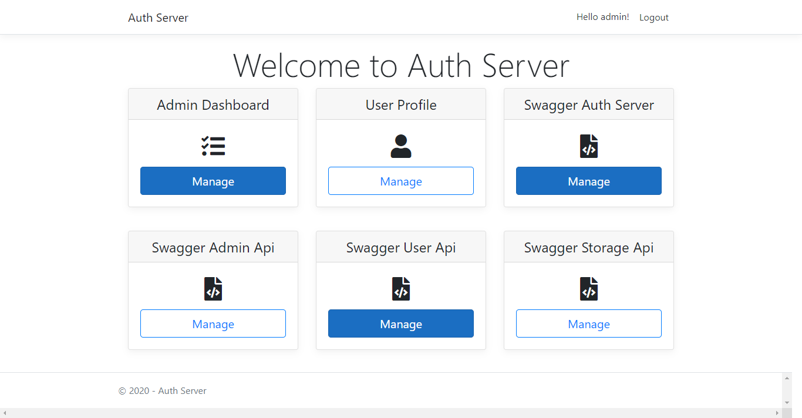
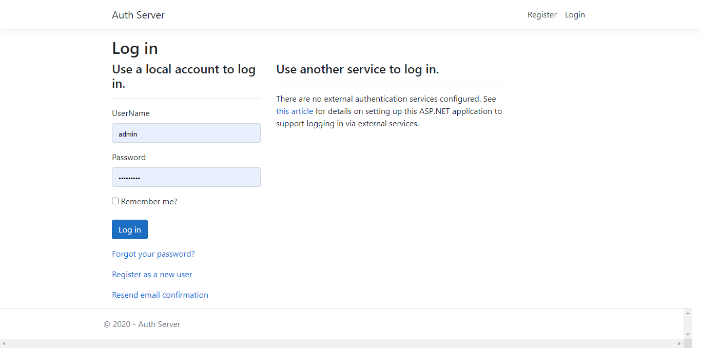
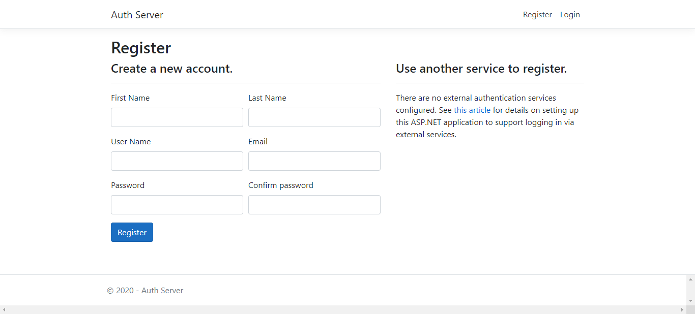
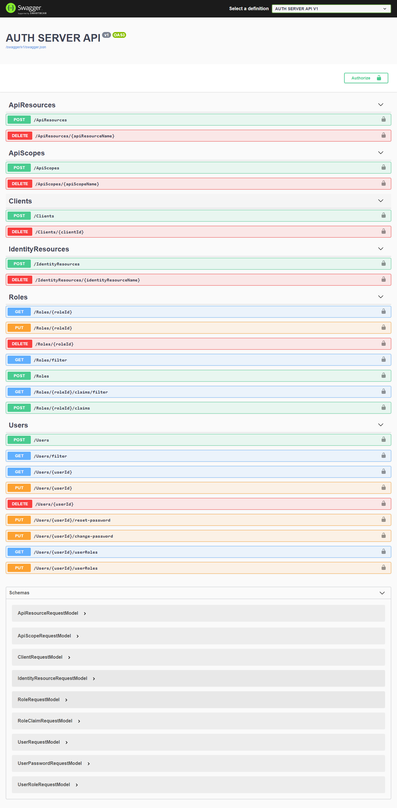

# Introduction 
`Auth Server` is a open source project for everyone. Every member can create new client, api resource, identity resource and login this with identity server 4. 

# Migration
- Add-Migration Initial -Context ApplicationDbContext -OutputDir Data/Migrations
- Add-Migration InitialPersistedGrantDbMigration -c PersistedGrantDbContext -o Data/Migrations/IdentityServer/PersistedGrantDb
- Add-Migration InitialConfigurationDbMigration -c ConfigurationDbContext -o Data/Migrations/IdentityServer/ConfigurationDb

#Technology Stack
1. ASP.NET Core 3.1
2. Angular 9.x
5. SQL Server 2019

# How to run this Project
1. Clone this source code from Repository
2. Build solution to restore all Nuget Packages
2. Set startup project is `auth-server`
4. Set startup project to multiple projects include: `auth-server`

# References
- [ASP.NET Core](https://docs.microsoft.com/en-us/aspnet/core/?view=aspnetcore-3.1)
- [Visual Studio](https://visualstudio.microsoft.com/)
- [IdentityServer4](https://identityserver.io/)

- https://medium.com/@matthew.bajorek/configuring-serilog-in-asp-net-core-2-2-web-api-5e0f4d89749c
- https://docs.microsoft.com/en-us/aspnet/core/performance/caching/distributed?view=aspnetcore-3.1

# Screenshot

- Welcome page

- Login page

- Register page

- Swagger api

# Reference
1. https://jakeydocs.readthedocs.io/en/latest/client-side/using-gulp.html